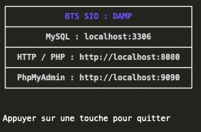

# DAMP - Docker Apache MySQL PHP

Ce repository contient les sources du projet DAMP, un environnement de développement web basé sur Docker.

Ce projet peut être utilisé tel quel :

- en utilisant le script `startup.sh`.
- ou via l'interface graphique [disponible ici](https://github.com/c4software/DAMP)

## Support d'installation

[Vous trouverez un guide d'installation ici](https://cours.brosseau.ovh/cheatsheets/damp/)

## Installation

Pour fonctionner, vous devez :

- Avoir docker sur votre machine (voir [ici](https://docs.docker.com/install/)).
- Avoir Bash ou DAMP GUI (interface graphique).

## Versions

Le projet utilise actuellement les versions suivantes :

- PHP 8.2 (avec pdo, zip, libpng)
- MariaDB 10.9
- PhpMyAdmin (dernière version)
- MongoDB (dernière version)
- MailHog (serveur SMTP de test)

Vous pouvez modifier les versions dans le fichier `docker-compose.yml`, et dans le dossier `dockerfiles` pour PHP qui utilise une version personnalisée.

## Utilisation

### Via le script `startup.sh`

Pour lancer le projet, il suffit de lancer le script `startup.sh` :

```bash
./startup.sh
```


